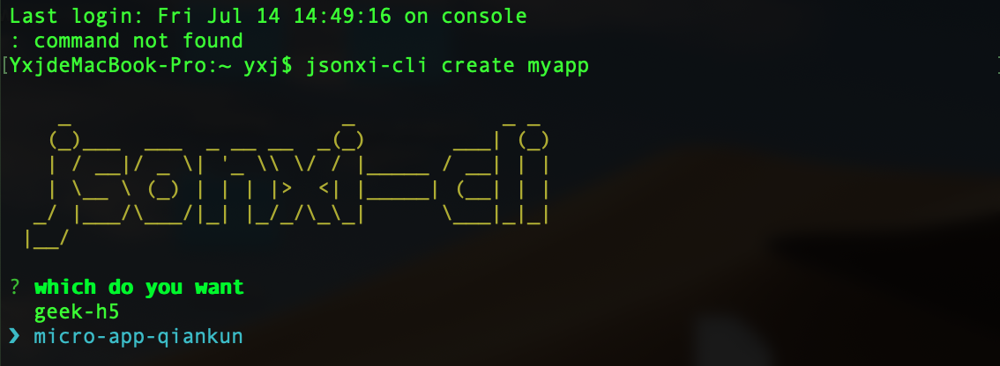

## 使用指南
基于 qiankun + vite + vue3 + ts 的微前端应用
### 通过 git clone
```bash
  git@github.com:xizhutao/react-template-creator.git

```
## 通过脚手架
[npm地址](https://www.npmjs.com/package/jsonxi-project-client)
```bash
# global install
npm i jsonxi-project-client -g
# and then run
jsonxi-cli create [name]

# or
npm i jsonxi-project-client
#then run
npx jsonxi-cli create [name]
```
### 选择 micro-app-qiankun

## 实现
1. 实现基于 ProComponent 的配置式布局
2. 实现异步获取菜单列表的页面权限控制
3. 实现基于 qiankun 的微前端架构，通过路由能加载对应的子应用
4. 通过 lerna 实现主应用、子应用单一仓库的多包管理
## 布局
常见的后台管理的系统无非是三种：
1. 侧边布局：主导航放置于页面的左侧固定位置，辅助菜单放置于工作区顶部。适用于同时存在多级导航菜单，菜单多层嵌套的系统。
2. 上下布局：主导航放置于页面的顶端。由于导航栏水平空间有限，适用于那些一级导航项没有很多的信息结构的系统。
3. 顶部-侧边布局：同样拥有顶部导航及侧边栏，适用于应用型的网站，但是会牺牲部分内容空间。
* 预览：[预览地址]()
## 项目目录
```bash
micro-app-qiankun
├─README.md
├─lerna.json
├─package.json
├─yarn.lock
├─packages
|    ├─vue-webpack-child # 子应用
|    |         ├─.browserslistrc
|    |         ├─.eslintrc.js
|    |         ├─babel.config.js
|    |         ├─package-lock.json
|    |         ├─package.json
|    |         ├─tsconfig.json
|    |         ├─vue.config.js
|    |         ├─src
|    |         |  ├─App.vue
|    |         |  ├─main.ts #入口文件
|    |         |  ├─public-path.js
|    |         |  ├─shims-vue.d.ts
|    |         |  ├─views #路由页面
|    |         |  |   ├─AboutView.vue
|    |         |  |   └HomeView.vue
|    |         |  ├─store #vuex 集中状态管理
|    |         |  |   └index.ts
|    |         |  ├─router 路由页
|    |         |  |   └index.ts
|    |         |  ├─components
|    |         |  |     └HelloWorld.vue
|    |         |  ├─assets
|    |         |  |   └logo.png
|    |         ├─public
|    |         |   ├─favicon.ico
|    |         |   └index.html
|    ├─react-vite-main 主应用
|    |        ├─.eslintrc.cjs
|    |        ├─index.html
|    |        ├─package-lock.json
|    |        ├─package.json
|    |        ├─tsconfig.json
|    |        ├─tsconfig.node.json
|    |        ├─vite.config.ts
|    |        ├─yarn-error.log
|    |        ├─src
|    |        |  ├─App.css
|    |        |  ├─App.tsx
|    |        |  ├─index.css
|    |        |  ├─main.tsx #入口文件
|    |        |  ├─vite-env.d.ts
|    |        |  ├─utils 
|    |        |  |   ├─request.ts #封装的 axios
|    |        |  |   └storage.ts #封装的操作 localStorage 的函数
|    |        |  ├─store #集中状态管理
|    |        |  |   ├─reducers
|    |        |  |   |    └user.ts
|    |        |  |   ├─context
|    |        |  |   |    └user.ts
|    |        |  ├─services 
|    |        |  |    ├─domain.ts #维护域名
|    |        |  |    └index.ts
|    |        |  ├─routes
|    |        |  |   └index.tsx #维护路由
|    |        |  ├─pages
|    |        |  |   ├─MicroApp
|    |        |  |   |    └index.tsx
|    |        |  |   ├─ErrorPage
|    |        |  |   |     └index.tsx
|    |        |  |   ├─DashBoard
|    |        |  |   |     └index.tsx
|    |        |  ├─micro #注册子应用
|    |        |  |   └index.ts
|    |        |  ├─config
|    |        |  |   ├─proDefaultConfig #ProComponent 配置文件
|    |        |  |   |        └index.tsx
|    |        |  ├─assets
|    |        |  |   ├─logo.png
|    |        |  |   └react.svg
|    |        ├─public
|    |        |   └vite.svg
├─assets
|   └cli.png
```
## 规范
commit 规范
* "feat", // 新功能（feature）
* "fix", // 修补 bug
* "bugfix", // 修补 bug
* "docs", // 文档（documentation）
* "style", // 格式（不影响代码运行的变动）
* "message", //注释&文案更改
* "refactor", // 重构（即不是新增功能，也不是修改 bug 的代码变动）
* "test", // 增加测试
* "revert", // 回滚
* "config", // 构建过程或辅助工具的变动
* "chore", // 其他改动

</br>分支规范
* master 最新代码维护在这个分支,除了 release 其余分支不能合进来
* feature/<需求> 需求分支从 master 切出,一次需求一个分支, 使用流水线需求发布到线上后会自动生成 release 分支,测试通过后将生成的
* release 分支合进 master,需求结束后及时删除 feature 分支
* hotfix /＜问题＞：紧急修复分支，从 master 分支切出，一次问题一个分支，修复完测试通过发布上线,将生成的 release 分支合进 master,删除该分支
* release: 流水线自动生成,在测试环境通过测试后将生成的 release 分支合进 master 并且勾选删除源分支,减少多余的分支
提交合并请求时需选择非自己的评审人查阅代码。
## 项目维护人员
* @xizhutao [1479069176@qq.com](https://mail.google.com/mail/u/0/?fs=1&tf=cm&source=mailto&to=1479069176@qq.com)
